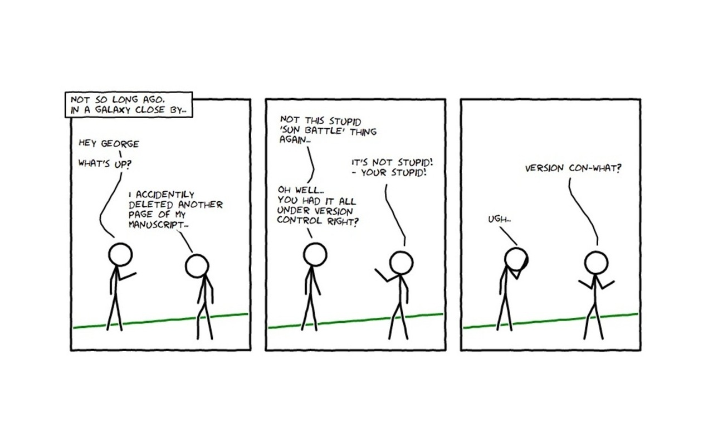

class: slideshow

# Intro version control

- 
- 
- 
- 

---

# Intro Version control

- vcs, cvs, rcs darcs, git
- bitbucket, gitlab, github
- version, release, feature
- commit, branch, merge, origin, remote
- distributed, push, pull, patch
- **why** should i care
- **why** was it introduced
- **why** so many alternatives for this simple question

---

# Why version control

## Lifecycle of software

1. Idea
2. Program
3. Do Samples, get new ideas
4. Do Bugfixes -> 2
5. Add Features -> 2
6. Release to customers, papers, collegues, friends -> 3

A -> B -> C -> D -> E ...

One think missing

---

## States of software


- **OOPS** Some glorious ideas turn out to be not sooooo smart, you have to go back (rollback)

    - I'm smart, i copy everything before i change something! Really smart?

- **UUPS** Your program is cute and solves many problems, but small adaptions are needed for each problem.

- **HMM** Other people start to send in great new features


---

### Look at Linux kernel

- The average number of changes accepted into the kernel per hour is 7.71, which translates to 185 changes every day and nearly 1,300 per week
- 2000 developers contributing in last 15 month

[arstechnica](https://arstechnica.com/information-technology/2015/02/linux-has-2000-new-developers-and-gets-10000-patches-for-each-version/)


---

## What are versions and how to manage

- Versionnumbers: Matlab2015a, Matlab2015b, Matlab12 ...
- Patches: small(?) changes which fix a bug, add a feature

**Commit** here: a group of changes applied to the sourcecode stored in history (for databases this is different)
**Patch** here: formated description of changed lines

`diff -p`

`git log -p`

---

## Restriction of **these** `diff` patches

- only applies(?) to text formats
- no understanding of meaning (change of whitespace)
- no understanding of meaning (not to be taken as independent)
- huge amounts of data for binary files

Rule of thumb:

- exclude *.o, generated executables ...
- store the generating code (dia, use svg)
- avoid Word, Excel as long (or as soon) as possible
- store large data changes as script

---

## git some commands

- `git init` creates a new (empty) repository in the current dir (creates `.git/`), make sure you are in a dir not already under VC
- `git status` shows the state of your files in relation to the repository, files can be untracked, changed, on stage or synchronized
- `git add` puts files on stage (either with file/dirnames or .)
- `git commit` puts a files state in the repository, either from stage or by file/dirname or -a for all
- `git log` shows the history of the repository

All commands are "smart", `git add .` only adds files which are untracked or not already on stage.
---

## some preparations to be done before starting

```
git config --global user.name 'Ford Prefect'
git config --global user.email 'fp@uol.de'
git config --global color.ui 'auto'
```

sets some defaults for this computer (stored in `~/.gitconfig`)

---

## git small example

Enter a dir with some textfiles not under VC

```terminal
┌─┤0 ms@tulip: /home/ms/t/git  ()
└ 23:09:28 Δ=? $ git init
Initialized empty Git repository in /home/ms/t/git/.git/
┌─┤0 ms@tulip: /home/ms/t/git  (master) ()
└ 23:09:58 Δ=? $ git status
On branch master
Initial commit
Untracked files:
  (use "git add <file>..." to include in what will be committed)
    Hard_Drive_Cat.jpg
    git-intro.md
...
nothing added to commit but untracked files present (use "git add" to track)
┌─┤0 ms@tulip: /home/ms/t/git  (master) ()
└ 23:11:15 Δ=? $ git add .
┌─┤0 ms@tulip: /home/ms/t/git  (master) ()
└ 23:13:24 Δ=? $ git status
On branch master
Initial commit
Changes to be committed:
  (use "git rm --cached <file>..." to unstage)

    new file:   Hard_Drive_Cat.jpg
    new file:   git-intro.md
...
```

